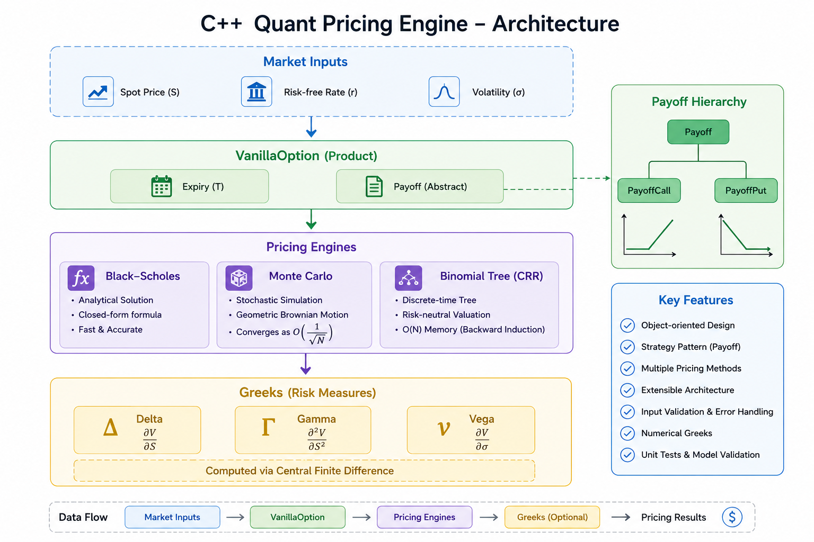

# C++ Quant Pricing Engine

A modular, object-oriented derivatives pricing engine implemented in modern C++.

---

## Architecture

<p align="center">
  
</p>
---

## Features

- Object-oriented architecture
- Strategy Pattern for payoff abstraction
- Black–Scholes analytical pricing
- Monte Carlo simulation
- Cox–Ross–Rubinstein (CRR) Binomial Tree
- Numerical Greeks using Central Finite Difference
- Parameter validation and error checking
- Unit tests comparing different pricing models

---

## Models Implemented

| Model | Status |
|-------|--------|
| Black–Scholes | ✅ |
| Monte Carlo | ✅ |
| Binomial Tree (CRR) | ✅ |
| Delta | ✅ |
| Gamma | ✅ |
| Vega | ✅ |

---

## Project Structure

```text
quant_pricing_engine/

├── include/
│   ├── BlackScholes.hpp
│   ├── BinomialTree.hpp
│   ├── Greeks.hpp
│   ├── Market.hpp
│   ├── MonteCarlo.hpp
│   ├── Payoff.hpp
│   └── VanillaOption.hpp
│
├── src/
│   ├── BlackScholes.cpp
│   ├── BinomialTree.cpp
│   ├── Greeks.cpp
│   ├── Market.cpp
│   ├── MonteCarlo.cpp
│   ├── Payoff.cpp
│   ├── VanillaOption.cpp
│   └── main.cpp
│
├── tests/
│   └── test_models.cpp
│
├── .gitignore
└── README.md
```

---

## Software Architecture

```text
                  Payoff
                     ▲
          ┌──────────┴──────────┐
          │                     │
     PayoffCall            PayoffPut
                    │
                    ▼
              VanillaOption
                    │
                    ▼
              Pricing Models
      ┌─────────┬──────────┬────────────┐
      │         │          │
 Black-Scholes Monte Carlo Binomial Tree
                    │
                    ▼
                  Greeks
```

The pricing models are decoupled from financial products through polymorphism, making the framework easy to extend with additional products and pricing algorithms.

---

## Pricing Models

### Black–Scholes

Analytical pricing model for European vanilla options.

---

### Monte Carlo

Monte Carlo pricing based on Geometric Brownian Motion:

\[
S_T=S_0e^{(r-\frac12\sigma^2)T+\sigma\sqrt{T}Z}
\]

A fixed random seed is used to ensure reproducible simulation results.

---

### Binomial Tree

Implementation of the Cox–Ross–Rubinstein (CRR) Binomial Tree model.

The pricing algorithm uses backward induction with **O(N)** memory complexity.

---

### Greeks

Delta, Gamma and Vega are computed using the **Central Finite Difference** method.

This design allows the same framework to compute Greeks for multiple pricing engines.

---

## Example Output

```text
========== European Call Option ==========

Black-Scholes Price : 10.4506

Monte Carlo Price   : 10.4378

Binomial Tree Price : 10.4489

Delta : 0.6368

Gamma : 0.0187

Vega  : 37.5240
```

---

## Validation

The implementation is validated by comparing numerical pricing models against the analytical Black–Scholes benchmark.

Included tests verify:

- Black–Scholes pricing
- Monte Carlo convergence
- Binomial Tree convergence
- Pricing consistency across different methods

---

## Design Highlights

- Modern C++ object-oriented design
- Clear separation between financial products and pricing algorithms
- Extensible architecture using polymorphism
- Independent pricing engines
- Numerical methods implemented from quantitative finance theory
- Simple and maintainable code structure

---

## Future Improvements

Potential extensions include:

- American Options
- Barrier Options
- Implied Volatility Solver
- Variance Reduction Techniques
- Pricing Engine base class
- CMake build system
- Continuous Integration (CI)

---

## Build

Compile all source files together.

Example:

```bash
g++ src/*.cpp tests/test_models.cpp -std=c++17
```

---

## References

- John C. Hull, *Options, Futures, and Other Derivatives*
- Steven Shreve, *Stochastic Calculus for Finance II*
- Cox, Ross and Rubinstein (1979)

---

## Author

**present777**

Fudan University

Mathematical Sciences

Quantitative Finance & C++